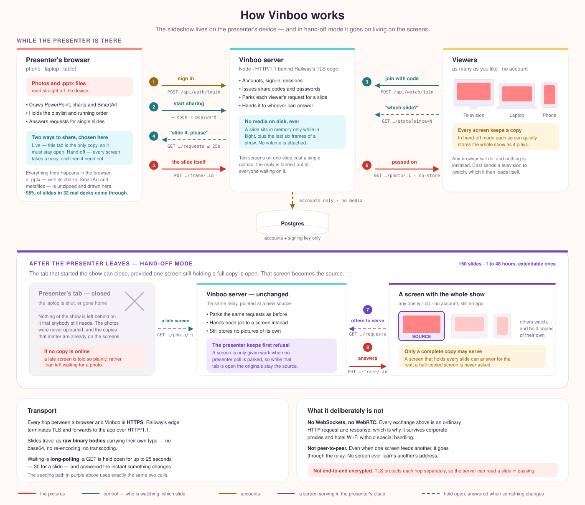
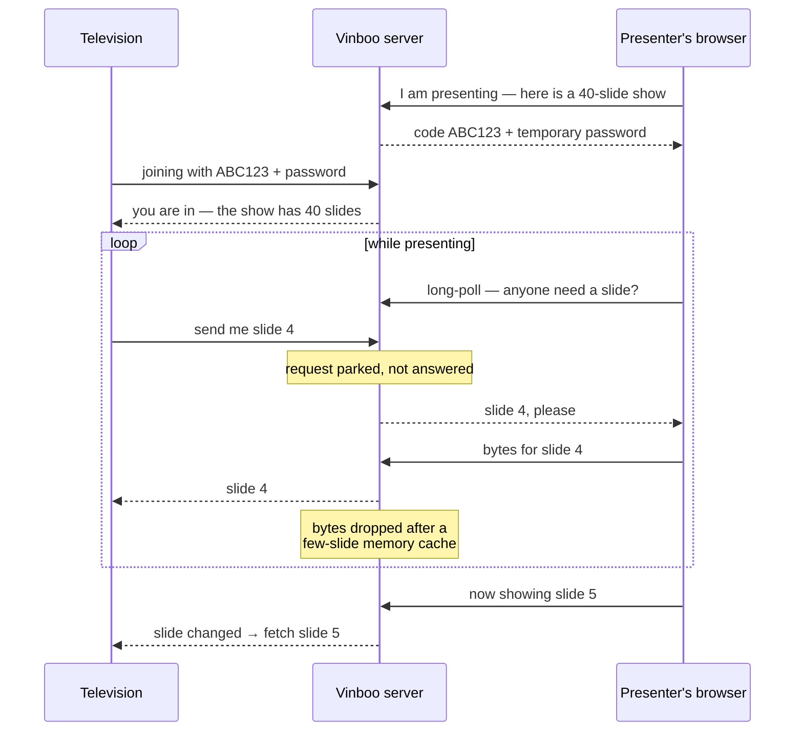
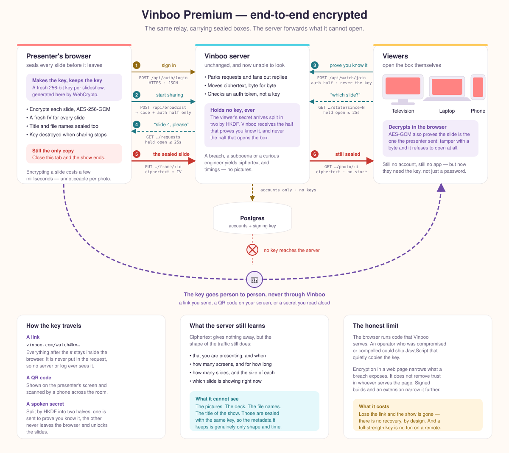

# Vinboo

**vinboo.com** — a web app for playing photo slideshows, with pause, start over,
and stop-and-pick-another-folder — plus the ability to share a slideshow live to
other browsers with a code and a temporary password.

You need an account to present. **Viewers don't** — a share code and temporary
password are all they need.

Everything plays from **your own device** — there is no server-side library and
nothing is ever uploaded.

- **A folder** on your drive, subfolders and all.
- **Your phone's camera roll**, on iOS or Android.
- **A PowerPoint** `.pptx`, rendered into slides in the browser.

The front end is plain HTML/CSS/JS with no build step and no framework. The
server has one dependency, `pg`, for Postgres.

## How it works



The unusual part is that **the server has no copy of your slideshow**. A viewer
asks for slide 4; rather than answering, the server holds that request open and
hands it to the presenter's browser, which sends the bytes back for the server
to pass on. Ten screens on the same slide cost the presenter one upload, because
the reply is fanned out to everyone waiting.



Everything on the presenter's side happens in the browser: photos are read off
the device, and a `.pptx` is unzipped and turned into SVG slides there too. The
server only ever sees the bytes of whichever slide is being looked at.

On the wire it is all ordinary HTTPS — **no WebSockets, no WebRTC, nothing
peer-to-peer** — which is why it works through corporate proxies and hotel
Wi-Fi without any special handling. Waiting is done by long-polling: a `GET` is
held open for up to 25 seconds (30 for a slide) and answered the instant
something changes. Slides move as raw binary bodies carrying their own type, so
nothing is base64-encoded or transcoded on the way. The diagram above labels
every hop with its method, path and payload.

## What end-to-end encryption would look like

**Not built.** This is a design sketch for a premium tier, kept here so the
shape of the change is on record.



Today the server can read a slide during the moment it passes through — TLS
protects each hop separately, which is not the same as end-to-end. Closing that
gap needs three things, and the relay itself needs none of them:

1. **Seal before sending.** The presenting browser generates a 256-bit key per
   slideshow and encrypts each slide with AES-256-GCM and a fresh IV. GCM also
   authenticates, so a tampered slide refuses to open rather than displaying
   something the presenter never sent.
2. **Get the key there without the server.** A link carries it in the fragment
   (`/watch#k=…`), which browsers never put in a request; a QR code covers a TV
   across the room. For a typed secret, HKDF splits it in two — one half is sent
   to prove the viewer knows it, the other never leaves the browser and does the
   decrypting.
3. **Seal the metadata too**, or the title and file names leak what the pictures
   were.

The relay code barely changes: it already moves opaque bytes it doesn't inspect.

What it would still leak is timing and shape — that you are presenting, for how
long, to how many screens, how many slides and how big each one is. And the
honest limit: the browser runs JavaScript that Vinboo serves, so an operator who
was compromised or compelled could ship code that copies the key. Encryption in
a web page narrows what a breach exposes; it does not remove trust in whoever
serves the page.

## Where this sits in the market

[docs/competitive-analysis.md](docs/competitive-analysis.md) surveys the
alternatives — slide-sync tools like ShowSlide and Sync, photos-to-TV apps like
Pixo, and the free defaults of Chromecast and AirPlay — and is honest about where
Vinboo loses as well as where it wins.

The short version: nothing else found does photos *and* PowerPoint, and nothing
else streams from the presenter's own device instead of uploading first. The
sharpest weakness used to be that the presenting tab had to stay open, which is
exactly what the party use case wants least; hand-off mode addresses that for
shows of up to 50 photos.

## Run it locally

You need Postgres. On a Mac:

```bash
brew install postgresql@17 && brew services start postgresql@17
```

Create a database and point the app at it:

```bash
createdb vinboo
npm install
DATABASE_URL=postgres://localhost/vinboo npm start
```

Then open <http://localhost:4321>. The schema is created on first boot.

## Accounts and the database

Accounts live in Postgres. On Railway, adding a Postgres service injects
`DATABASE_URL` and the app picks it up with no further configuration.

Passwords are hashed with scrypt. The key used to sign session cookies is
generated once and kept in the database rather than on disk, so cookies survive
a redeploy with no volume attached, and every instance signs identically.

Set `SIGNUP_CODE` to stop strangers registering on a public instance. When it's
set, the sign-up form asks for it. (The old `ACCESS_CODE` variable still works
as the sign-up code.)

### Schema changes

Migrations are numbered SQL files in `migrations/`, applied in filename order
and recorded in `schema_migrations` so each runs exactly once. To change the
schema, add a file — never edit one that has already been applied:

```
migrations/0002_add_albums.sql
```

They run automatically when the server starts, so a deploy migrates itself. To
run them by hand:

```bash
npm run migrate
```

Because Railway can start several containers during a deploy, the whole run is
wrapped in a Postgres advisory lock: the first instance migrates, the others
wait and then find nothing to do.

### Coming from the old JSON file

Earlier versions kept accounts in `DATA_ROOT/users.json`. On first boot against
an empty `users` table, any accounts in that file are imported automatically,
password hashes intact, and the file is then left alone. Nothing is imported
once the table has rows, so it can't duplicate or clobber live data.

## Sharing a slideshow to other browsers

Pick a folder from your device, then hit **Share…**. You get a six-character
share code and a temporary password:

```
Share code:          RJ33DT
Temporary password:  WUE8-75HE-GDUH
```

On any other browser — a TV, a laptop, a phone — open `/watch`, type both in,
and that screen mirrors whatever slide you're on. Viewers need no account. Your
controls drive every screen: pause, next, start over, shuffle.

Signed-in users get a **Watch a show** button in the header too, since a
presenter often wants the slideshow on the screen in front of them as well. It
opens in a new tab, so a slideshow this tab is sharing keeps running.

The join form does the fiddly parts. The code is upper-cased as you type and
jumps to the password once it has six characters; the password's hyphens are
typed in for you, so `p5nxuy7n5u7z` becomes `P5NX-UY7N-5U7Z`. The hyphens are
there to make a password readable across a room, not to be part of the secret —
the server compares on the letters alone, so any spacing or case gets in.

**Your browser is the source.** The photos are streamed live from the tab you're
presenting from and are never uploaded or written to the server's disk. The
server only relays bytes: a viewer asks for slide 4, the relay hands that
request to your tab, your tab sends the bytes, and they stream on to whoever
was waiting. They sit in server memory only while in flight, plus a small
bounded cache so ten viewers on the same slide cost you one upload rather than
ten.

The trade-off of that privacy is a hard requirement: **the presenting tab has to
stay open and awake.** If it closes, sleeps, or loses its connection, viewers
stop getting slides, and the broadcast is torn down after a minute of silence.
Codes also expire six hours after they're created, and stop working the moment
you press **Stop sharing**.

Both credentials are needed, wrong guesses are rate-limited to 10 per IP per 15
minutes, and the failure message is identical for a bad code and a bad
password, so neither can be probed independently.

### The address a presenter reads out

The share dialog names the site, not the hostname the app happens to be answering
on. A platform gives a deployment a name like
`slideshow-production-1c4f.up.railway.app`, which is useless to somebody
standing at a television with a remote — so the dialog says `vinboo.com/watch`.

Serving from a laptop or over a home network is the exception: there the real
host is the only one that reaches the server, so `localhost:4321` or
`192.168.1.40:4321` is shown instead. Anyone self-hosting on their own domain
should set `SITE_HOST` (or `SITE_URL`).

### What actually goes over the wire

Slides are converted before sending, rather than the file being forwarded as it
sits on disk. That is not an optimisation; it is what makes a television work.

A TV's browser is an old engine with a small decode budget, and it is strict
where Chrome is forgiving:

- **Chrome sniffs a mislabelled image and renders it anyway.** A television
  refuses. A `File.type` is filled in by the operating system's picker and is
  frequently empty — HEIC especially — so the type is now read from the bytes
  themselves rather than trusted.
- **Televisions cannot decode HEIC, AVIF or TIFF at all**, which is exactly what
  a phone's camera roll is full of.
- **A full-resolution photo exhausts the decode budget.** A 12-megapixel image
  needs about 48 MB decoded, whatever its file size suggests.

So the presenting browser redraws each slide once through a canvas: at most
2560px on the long edge, as JPEG, or PNG where transparency matters. Whatever
this browser can display, it can draw, so anything it plays locally is something
it can send. A photo that is already JPEG, PNG or GIF within that size is passed
through untouched — no recompression and no loss. Converted slides are
remembered, so twelve screens asking for the same slide convert it once.

PowerPoint slides used to go over as SVG, which televisions render poorly; they
are rasterised the same way.

Local playback is unaffected and still uses the original file at full
resolution. Only what leaves the device is normalised.

As a last resort the viewer retries a slide as an inline `data:` URL, because
some television browsers fetch a `blob:` URL correctly and then refuse to load
it into an ``.

### Handing off, so you can close the tab

Pressing **Share…** asks which of two arrangements you want.

**Keep this tab open** is the above: you drive every screen, any number of
photos, and the show ends when you leave.

**Hand off to the screens** is for when you want to set a slideshow going at a
party and then put your phone in your pocket. Each screen copies the photos into
its own browser storage as it joins, and once it has the lot it runs the show by
itself — no server, no presenting tab. It starts at the first photo rather than
dropping you into the middle of a loop.

Because the screen owns its copy, it gets its own controls: play and pause,
back and forward, start over, and its own speed. Arrow keys, space, `R` and `F`
work too, which is what a television remote actually sends. A screen following a
live presenter has none of this — there the presenter drives, and the screen has
nothing of its own to decide.

**One screen has to stay on for the life of the show.** The photos live on the
screens, not on a server, so a screen that already holds a copy keeps playing on
its own — but if every screen goes off, there is nothing left for a new one to
copy from, and nobody else can join until one comes back. The share dialog and
the broadcast bar both say so.

While the copying is happening the tab still has to be open, because it is still
the only source of the pictures. The broadcast bar counts the screens up and
tells you plainly when you're done:

```
Handed off "Barbecue"
Code 6QAHVF · password EY82-MYH9-6SAX · 3 screens · ends in 23h 40m
Safe to close this tab — all screens have a full copy.
```

Screens can still join after you have gone. Once a screen holds the whole show
it becomes a source itself, so a television switched on an hour later gets the
photos from a screen that already has them. The relay only routes work to a
screen when no presenting tab is listening, so while your tab is open the
originals stay the source.

**If no screen with a copy is there, nobody new can join.** A screen that is
switched off stops counting as a source within about a minute, and a joiner is
told so at once rather than being left on a spinner:

> Nobody with a copy of this slideshow is online right now. It starts again as
> soon as a screen that has one comes back — otherwise ask the presenter to
> share it again, which gives a new code.

The show is not torn down when that happens — it still runs to its deadline, and
the code keeps being accepted. A screen that comes back still holds its copy in
its own browser storage, so it rejoins, finds every slide locally, and starts
serving again without needing the presenter or any other screen.

The presenter cannot revive it, though: sharing again always mints a new code,
because the browser does not keep the folder you picked once the tab has gone.
So the honest summary of a handed-off show with nobody online is that **the code
still works, the show is still running, and there are simply no photos to be had
until something that holds a copy comes back.**

For a few minutes after the last screen leaves, the relay's own cache can still
answer for a short show — it holds six frames, dropped after five minutes idle.
After that it is genuinely empty.

Hand-off is deliberately hemmed in, because copies on other people's devices are
harder to take back than a stream:

- **50 photos at most.** Above that the option is greyed out and says why.
- **1 to 48 hours**, chosen when you share, 24 hours by default. When the time
  is up the server drops the show and every screen deletes its copy.
- **Extending is not cumulative.** **Extend 48h** moves the deadline to 48 hours
  from *now*, so no amount of extending turns a slideshow into a permanent one.
  Come back and extend, or it goes away on its own.
- **Three handed-off shows per account.** Starting a fourth is refused until you
  take one down.
- Starting a new share does not disturb a handed-off show already running, which
  is the one exception to one-broadcast-per-account.

The screens delete their copies when the show ends — whether it timed out, you
pressed **Stop sharing**, or you never came back. A screen also drops any older
show's copy when it joins a new one, so a television holds at most one slideshow
at a time. Nothing is uploaded in either mode; the difference is only whether
the copies live on the screens or stream from your tab.

### What a handed-off show costs the server

Nothing durable — the server never holds the slideshow. What it keeps is
bookkeeping plus a small, short-lived relay cache. Measured on this machine with
200 concurrent 50-slide shows of eight screens each, using a 1.16 MB median
photo:

| | Per show | Held for |
| --- | --- | --- |
| Session bookkeeping (code, hashes, screen list, deadline) | ~2.9 KB | the full 1–48 hours |
| Relay cache, while screens are copying | up to 6 photos ≈ 6.6 MB | minutes |
| Relay cache, once copying stops | 0 | dropped after 5 minutes idle |

The relay cache is a fan-out optimisation, not storage: it holds the last six
photos so that ten screens copying the same slide cost one upload rather than
ten. It is capped at six frames and 64 MB, it never grows with the length of the
show, and it is cleared once a show goes quiet — the screens have their own
copies, so there is nothing there worth keeping. An idle handed-off show
therefore costs about three kilobytes a day.

For contrast: actually storing a 50-photo show on the server for its full life
would be roughly 58 MB per show, or 5.7 GB across a hundred concurrent shows.
That is the cost the hand-off design avoids, and the reason the photo cap exists
on the screens rather than on a disk somewhere.

## Casting to a television

The player has a **Cast** button. It sends the *viewer page* to the television
rather than the pictures, so the TV becomes an ordinary viewer pulling each
slide through the relay and following along as you present.

That indirection is the whole trick. Google's default media receiver loads media
by URL, and these photos are `blob:` URLs that exist only inside the presenting
tab — a Cast device can never fetch them. Handing it `/watch` sidesteps the
problem entirely and costs nothing: no receiver app to register, no media to
upload.

The URL carries a **single-use ticket** instead of the password. It is good for
three minutes, dies the moment it is redeemed, and is stripped from the address
bar afterwards, so nothing reusable is left sitting in a television's history.

Support depends on the browser, so the button adapts:

- **Chrome and Edge on desktop** get the Presentation API and a device picker.
- **Everywhere else** — Safari, Firefox, phones — the button copies the one-time
  link instead. Open it on the TV's own browser, or send it to whoever is next
  to the screen. It works on anything that can open a URL.

Older Chromecasts run a limited receiver; a Chromecast with Google TV, or any
smart TV with a browser, handles the viewer page comfortably. If a device gives
trouble, the copied link opened in the TV's browser always works.

## Play from this device (no upload)

The “Play from this device” panel has three ways in:

| Button | What it opens | Where it works |
| --- | --- | --- |
| **Photos…** | the system photo picker | everywhere, including iPhone and Android |
| **Folder…** | a whole folder, subfolders and all | desktop and Android |
| **PowerPoint…** | one or more `.pptx` files | everywhere |

You can also drag a folder onto the drop zone.

The files are read directly by the browser and played from in-memory object
URLs. They are never sent to the server — you can confirm this in the network
panel, where playback makes no requests at all. The trade-off is that the
selection is per-tab and per-session: reloading clears it, because browsers
don't let a page silently re-open a local folder later.

Presenting requires a signed-in account, so this panel sits behind the sign-in
screen even though local playback itself needs nothing from the server. Watching
a shared slideshow is the one flow that needs no account.

### Browsing the hierarchy

Whatever you pick becomes a browsable tree. Each folder is a card: **Open**
walks into it, **Play** plays it *and everything beneath it*. A breadcrumb
across the top walks back out. The first card in any folder — “All of …” —
plays that whole branch, so you can show one holiday or the entire drive
without reorganising anything.

If a chosen folder just wraps a single subfolder, the two are collapsed into
one step, so picking `Pictures` doesn't strand you on a lone `DCIM` to click
through.

### Phones

iOS and Android don't expose photo albums to a web page — there is no browser
API for them, so no app can read your albums directly. What they do expose is
the system picker, which is what **Photos…** opens.

Since the picker hands over files with no folder structure, the hierarchy is
rebuilt from each photo's own date, giving a **Year › Month** tree to browse.
Android sometimes supplies a real path, and when it does that's used instead.

One caveat worth knowing: iPhones shoot **HEIC**, which only Safari can
display. Going through a file picker, iOS usually converts to JPEG on the way
out, so this rarely bites — but if you land on HEIC files in a browser that
can't decode them, the app probes one and tells you rather than showing a wall
of broken images. To force JPEG: *Settings › Photos › Transfer to Mac or PC ›
Automatic*.

## PowerPoint

Pick a `.pptx` with **PowerPoint…**, drop one in, or drop one into the server
library — either way it plays as a slideshow, and it can be shared live like
anything else.

The conversion happens **entirely in your browser**. A `.pptx` is a ZIP of XML,
which the browser can already unpack, so each slide is turned into a
self-contained SVG with its images inlined. Nothing is sent anywhere to be
converted, there's no LibreOffice on the server, and decks stream through the
sharing relay as ordinary images because that's what they've become.

What comes through: slide order and size, backgrounds, text with its font,
size, weight, colour, alignment, wrapping and bullets, pictures, shapes with
fills and outlines, connectors, grouped shapes, and tables.

What doesn't: animations and transitions, charts and SmartArt (drawn as a
labelled placeholder so the layout still reads), 3-D effects, and WordArt.
Gradients are approximated by their first colour stop.

Two things follow from rendering rather than screenshotting. Decks stay sharp
at any size and stream as a few KB per slide instead of a full-resolution
image. But the deck's fonts usually aren't installed on the machine showing it,
and substituted fonts measure differently — so text that fitted in PowerPoint
can wrap differently here. Text that would overflow its box is shrunk to fit,
the same thing PowerPoint does, rather than being allowed to overlap whatever
sits below it.

Only `.pptx` works. The older binary `.ppt` is a completely different format;
open it in PowerPoint and save it as `.pptx`.

### Charts and shapes

Charts are drawn, not stubbed. PowerPoint caches a chart's categories and
values inside the chart part alongside the reference to its workbook, so the
numbers are already on the slide — bar and column (clustered and stacked), line,
area, pie and doughnut all render from that cache, with the title, legend,
gridlines and axis ticks. Nothing is uploaded and no spreadsheet is opened.

Two details worth knowing, because both were wrong before they were tested
against real decks:

- Categories are often stored in a **multi-level** cache rather than a flat one,
  which happens as soon as an axis has any grouping. Reading only the flat cache
  loses every label on the axis while leaving the chart otherwise correct.
- A chart carries **the colour its own text should be**. Charts on dark slides
  declare white labels, so a hard-coded grey renders a title that cannot be read
  on exactly the slides that were designed most carefully.

Preset shapes cover the ones that carry meaning in a diagram: arrows in all four
directions plus the two double-headed ones, chevron, home plate, triangle,
diamond, parallelogram, trapezoid, pentagon, hexagon, octagon and plus, along
with elbow connectors. A flipped shape mirrors its outline but not its text,
which is what PowerPoint does. Anything else still falls back to a rectangle.

**Not rendered:** SmartArt, and embedded objects whose preview is an EMF or WMF
metafile — both leave a labelled placeholder so the slide still reads the way it
was laid out. Rendering a metafile faithfully means implementing a Windows
drawing interpreter, which is a poor trade for the number of slides it affects.

## Playback controls

| Control | Keyboard | What it does |
| --- | --- | --- |
| Play / Pause | `Space` | Pause on the current photo, resume where you left off |
| Next / Previous | `→` / `←` | Step through by hand |
| Start over | `R` | Jump back to the first photo and play from the top |
| Stop | `Esc` | Leave the slideshow and go back to folder selection |
| Fullscreen | `F` | Fullscreen the player |
| Shuffle | `S` | Random order |
| Loop | `L` | Wrap around at the end, or stop on the last photo |

Speed is adjustable from 1 to 30 seconds per photo. Clicking the photo toggles
pause, and the controls fade out while playing until you move the mouse. The
controls behave identically whichever source the photos came from; a badge next
to the counter shows which one is playing.

## Tests

Four suites.

The deck tests (ZIP reader, XML parser, PowerPoint rendering) need nothing
running — the fixture presentation is built in memory:

```bash
npm run test:deck
```

The database tests cover migrations, the account store, the signing key and
transactions. They truncate tables, so they refuse to run against a database
whose name doesn't end in `_test`:

```bash
createdb vinboo_test
DATABASE_URL=postgres://localhost/vinboo_test npm run test:db
```

The relay tests cover the bookkeeping that the clock drives — a live show dying
when the presenting tab goes quiet while a handed-off one survives, the photo cap
and the 1-to-48-hour clamp, and the fact that extending never stacks up. They
move the clock by hand rather than waiting, so they need nothing running:

```bash
npm run test:broadcast
```

The end-to-end suite covers accounts, the relay and the sharing lifecycle
against a running server:

```bash
DATABASE_URL=postgres://localhost/vinboo_test PORT=4399 node server.js &
sleep 2 && npm run test:e2e
```

`npm test` runs all four; it expects `DATABASE_URL` to point at a `_test`
database and a server already listening on 4399.

Both suites that touch data refuse to run against anything that isn't a `_test`
database — the end-to-end suite asks the server which database it is using via
`/healthz` and stops if the answer looks like a real one. That matters because a
stray server left holding port 4399 will happily answer, and it may be pointed
somewhere you did not intend. If a run reports the wrong database:

```bash
lsof -ti:4399 | xargs kill -9
```

## Configuration

All optional, all via environment variables:

| Variable | Default | Purpose |
| --- | --- | --- |
| `DATABASE_URL` | *(required)* | Postgres connection string; Railway injects it |
| `DATABASE_SSL` | *(auto)* | `require` or `disable` to override TLS detection |
| `DATABASE_POOL_MAX` | `10` | Maximum pooled connections |
| `PORT` | `4321` | Port to listen on |
| `HOST` | `0.0.0.0` | Bind address |
| `DATA_ROOT` | `./data` | Legacy accounts file, imported once on first boot |
| `SIGNUP_CODE` | *(unset)* | If set, required to create an account |
| `SESSION_SECRET` | *(unset)* | Overrides the signing key kept in the database |
| `MAX_FRAME_BYTES` | `26214400` | Largest photo that can be streamed live (25 MB) |
| `SITE_HOST` | `vinboo.com` | The address shown to a presenter to read out |
| `SITE_URL` | *(unset)* | Full public origin; overrides `SITE_HOST` and is used for cast URLs |

## Deploying to Railway

1. Create a Railway project from this GitHub repo. Nixpacks detects Node, runs
   `npm install` and then `npm start`; `railway.json` sets the health check to
   `/healthz`, which reports unhealthy if the database is unreachable.
2. **Add a Postgres service, then reference it from the app.** This is the step
   that catches people out: adding a database to the project does *not* share
   its variables with your app service. In the **app** service go to
   *Variables → New Variable* and add:

   | Name | Value |
   | --- | --- |
   | `DATABASE_URL` | `${{ Postgres.DATABASE_URL }}` |

   Use your database service's actual name in place of `Postgres`. Redeploy, and
   the schema is created on the first boot.

   **The name doesn't actually matter.** Any variable whose value starts with
   `postgres://` is used, whatever it's called, and the discrete
   `PGHOST`/`PGUSER`/`PGPASSWORD`/`PGDATABASE` set works too. `DATABASE_URL` is
   just the convention.

   If nothing is found the app exits immediately with instructions rather than
   starting up broken, and prints the names of the database-related variables it
   can actually see (names only — never values). Two failures look different:

   - *"none of them database related"* — the reference was never added, or was
     added to the database service instead of the app service.
   - *"unresolved Railway reference"* — the variable exists but still contains
     the literal `${{ … }}`, meaning the service name inside it doesn't match
     any service in the project. Copy the exact name from the database service's
     card; Railway autocompletes it once you type `${{`.
3. **No volume is needed.** Accounts live in Postgres and slideshows live on
   the presenter's device, so this process stores nothing on disk.
4. **Set `SIGNUP_CODE`** to something only your people know, or anyone who finds
   the URL can register.
5. Don't set `PORT` — Railway injects it.

The app connects over Railway's private network (`*.railway.internal`), which
doesn't use TLS; TLS is enabled automatically for any other host. Because the
container can start before the database is accepting connections, the first
connection retries with backoff instead of crash-looping the deploy.

Live sharing holds requests open for up to 30 seconds at a time, which Railway's
proxy handles fine. Broadcast state is kept in memory, so a redeploy ends any
slideshow in progress — presenters just hit Share again for a fresh code.

## Adapting to the device

The layout follows what the device can actually do rather than what its user
agent claims, using `pointer`, `hover` and size queries:

- **Touch**: 44px minimum targets, 16px form fields (anything smaller makes iOS
  zoom on focus), no hover effects — a hover lift sticks after a tap and reads
  as a stuck button — and the drag-and-drop zone is hidden, since there is
  nothing to drag with.
- **Phones in landscape**, which is how slideshows are actually watched: the
  controls stop taking layout space and float over the bottom of the photo, so
  the picture gets the full height instead of losing a third of it.
- **Viewport height** uses `dvh`, because `100vh` on a phone is measured against
  the browser chrome being hidden and pushes the controls below the fold. Safe
  area insets keep them clear of the home indicator and notch.
- **Televisions** (very wide viewports) scale the viewer's type and controls up,
  and the chrome fades out after a few seconds so a screen left running all
  evening shows only the photo.
- **iOS** is the one thing named rather than feature-detected: Safari exposes
  `webkitdirectory` on file inputs but ignores it, so whole-folder picking can't
  be detected and the Folder button is simply not offered there. Photos and
  PowerPoint still are.

## SEO and link previews

Both public pages carry a title, meta description, canonical URL, robots
directive, Open Graph and Twitter card tags, and the landing page adds
`WebApplication` JSON-LD. `public/robots.txt` and `public/sitemap.xml` are
served as static files.

The share card at `public/brand/og-image.png` (1200×630) is what appears when
someone pastes a link into a message or a post — which, for an app people invite
each other to, is a more common first impression than a search result.

All the absolute URLs point at `https://vinboo.com`. If the site ever moves,
those are the strings to change: the canonical and `og:url` tags in
`public/index.html` and `public/watch.html`, plus `robots.txt` and
`sitemap.xml`.

## Analytics

Both public pages carry the Google tag (`gtag.js`) for measurement ID
`G-XXF25X6BPJ`. The ID is written into `public/index.html` and
`public/watch.html` — those are the two places to change it.

Two things worth knowing about what it will and won't show:

- **One page view per visit.** The app moves between the landing page, the
  library and the player without navigating, so a whole session of presenting
  registers as a single view. If you want to see which parts get used, that
  needs explicit `gtag('event', …)` calls at those transitions.
- **Viewers are counted too**, since the tag is on `/watch` as well. That is
  probably what you want — it is the only way to see how many screens a
  slideshow actually reached — but it does mean people who never signed up are
  measured.

If the site takes visitors from the EU or UK, analytics cookies generally need
consent before they are set, which this does not currently ask for.

## Look and feel

The visual system comes from the logo, and the palette is sampled from the
artwork rather than eyeballed:

| Role | Colour | |
| --- | --- | --- |
| Coral | `#FF8382` | primary actions, live indicators |
| Cyan | `#51D1E3` | toggles, badges, focus rings |
| Amber | `#FDCA5C` | presentations, cautions |
| Paper | `#FFFAF5` | page |
| Ink | `#2A2440` | text |

The pastels are used at full strength as **fills, paired with deep ink text**
rather than white. That was a deliberate call: darkening the coral far enough to
carry white text at 4.5:1 turns it into a plain red and loses the brand. Ink on
brand coral measures 6.2:1, on cyan 8.1:1, and on amber 9.7:1 — so the exact
logo colours survive and the contrast is comfortably past AA. Deepened variants
(`#C8362F`, `#1F7884`, `#936A10`) carry links and small text on paper.

Everything is pill-shaped or generously rounded to echo the logo's letterforms,
with soft warm shadows instead of hard borders. On Apple devices the type uses
`ui-rounded` (SF Pro Rounded), which is close to the logo's face and costs no
web font download; elsewhere it falls back through Nunito to the system stack.

**The player stays dark.** Photos and slides read best against near-black, so
the stage keeps a `#12101C` chrome and takes the brand in as accents — the coral
play button, the cyan toggles, a coral-to-amber progress bar. Chrome is styling;
the viewing surface is function.

Brand assets live in `public/brand/` (wordmark, square mark, and favicons),
derived from the source logo.

## Notes on safety

- The server never reads or writes slideshow files, so there is no upload path
  and no file-serving path to get wrong.
- Sign-ins, sign-ups, and share-code attempts are each rate-limited per IP.
- Every query is parameterised, so account data can't be reached by injection,
  and username uniqueness is enforced by a database index rather than by a
  check-then-insert that two simultaneous sign-ups could slip through.
- On-device playback never transmits the files. Object URLs are minted lazily
  and revoked as playback moves on, so a large folder isn't held in memory all
  at once.
- Passwords are hashed with scrypt and compared in constant time. A sign-in
  attempt for an unknown username still does the hashing work, so a miss can't
  be spotted by how fast it fails.
- Share codes and temporary passwords are generated from `crypto.randomBytes`
  with unbiased character mapping, and only their hashes are kept in memory.
- Streamed photos are sent with `Cache-Control: no-store` so no proxy retains a
  copy, and a broadcast's memory cache is dropped the moment it ends.
- **Hand-off is the one place a copy leaves your device.** In that mode each
  viewing browser deliberately writes the photos into its own Cache Storage so
  it can keep playing without you. The server still never sees a file, but the
  screens hold real copies, which is why the mode is capped at 50 photos and 48
  hours and why the copies are deleted when the show ends. Anyone with physical
  access to a screen has those photos until then. If that isn't acceptable for a
  particular set of pictures, use **Keep this tab open** instead.
- Only the account that started a broadcast can drive it or end it.
- A screen can only serve photos to other screens once it holds the whole show,
  and only for a handed-off slideshow. Everyone involved already holds the same
  code and password, so a screen can pass on what it was given — but a screen
  that has copied nothing cannot pose as a source.
- Rendered slides are built as escaped SVG and shown through ``, so a
  booby-trapped deck can't run script — in the presenter's browser or in a
  viewer's.

## License

MIT
